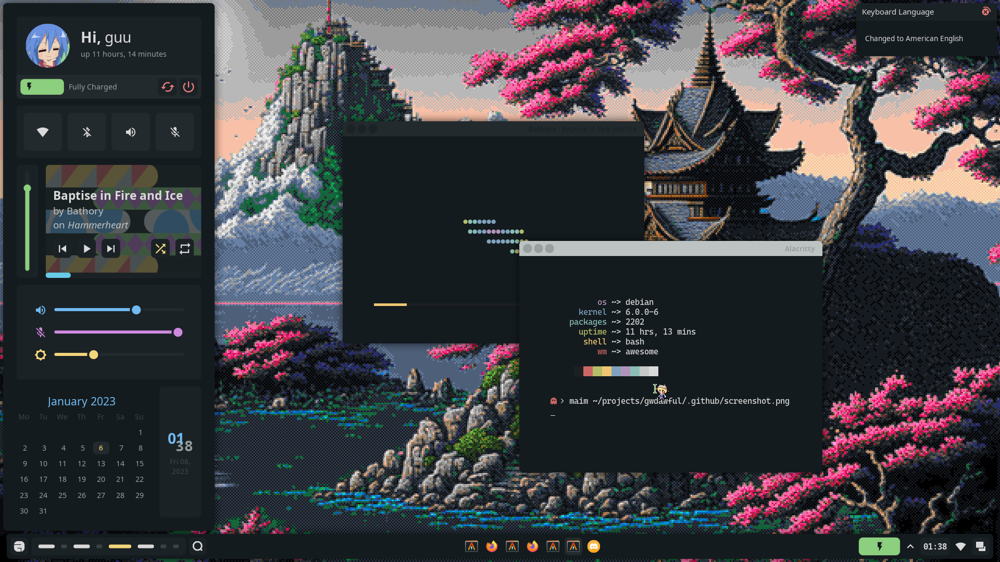

# Welcome, stranger!

This is my awful configuration for the almighty AwesomeWM, featuring a 
user configuration file, repositionable bar and titles, dashboard,
notifications, screenshooting tools, multiple colorschemes, and more to
come, all done with Awesome's widget API!



## Dependencies

### Mandatory
- Awesome-git (duh)
- mpd, mpDris2, and playerctl
- Network Manager
- Pipewire and Wireplumber
- Roboto, Material Icons, and CascadiaCode Nerd Font
- xclip

### Optional (toggleable)
- brightnessctl
- bluez and bluez-utils
- upower

----------------------
This configuration also uses alacritty, nvim, firefox, htop, lf, thunar, 
xclip and rofi by default, but none of these are hard requirements and 
you can easily change them in `userconf.lua`, although I still 
recommend **at least installing alacritty**.

## Installation

Install the dependencies listed above for your own distro. After that is
done you need only run:
```sh
$ git clone https://github.com/Gwynsav/gwdawful.git --recursive
$ mkdir ~/.config/awesome/
$ cp -r gwdawful/* ~/.config/awesome/
```
Also note that CascadiaCode Nerd Font is very likely not packaged for your
distro. It can easily be installed by [getting it](https://github.com/ryanoasis/nerd-fonts/releases/download/v2.2.2/CascadiaCode.zip), 
putting it in either `/usr/share/fonts` or `~/.local/share/fonts/` and 
running `fc-cache -f`.

And that is basically it, note that I do not provide configuration files 
for the programs used by default, this is because those are written in Nix
for my [NixOS rice](https://github.com/Gwynsav/nix-dots/tree/master/users/gw/config). 
You may still use them as reference but they don't exactly work if you're
not using Nix with Home Manager as is.

# References
These people's dotfiles (and in some cases they themselves) have massively
helped me create this configuration.

[Alpha.'s NixOS Awesome setup](https://github.com/AlphaTechnolog/nixdots). 
General reference and stole his helpers :)

[Stardust-kyun's dotfiles](https://github.com/Stardust-kyun/dotfiles). 
Basically the first thing I started reading when I got into Awesome.

[Aproxia's dotfiles](https://github.com/Aproxia-dev/.dotfiles). 
Funny animation ghost.

Also got a few ideas from [elenapan's dotfiles](https://github.com/elenapan/dotfiles) 
and [rxyhn's Yoru](https://github.com/rxyhn/yoru).
